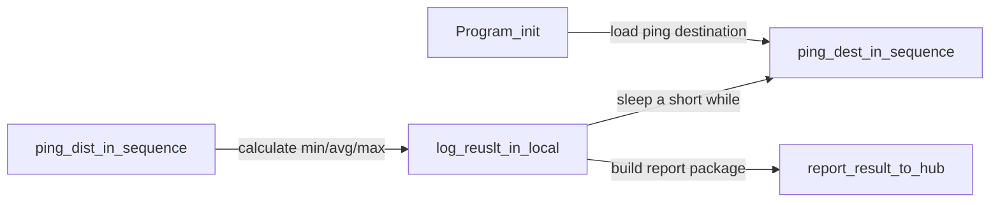
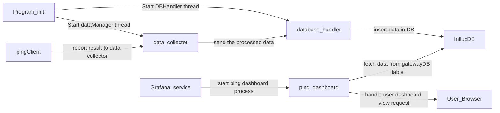
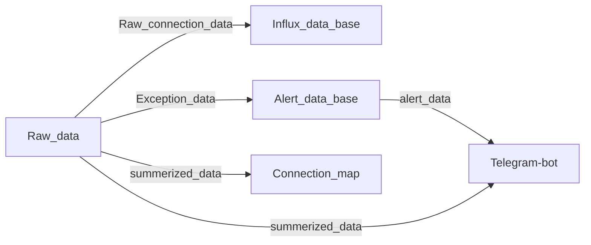
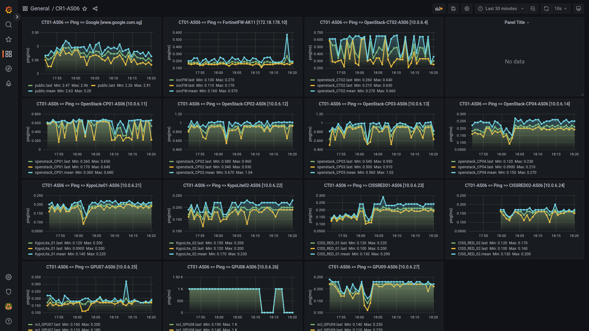

# Server Connection Dashboard [Ping]

**Program Design Purpose**: This program is a monitor hub system to check and display the servers/switches/gateways/nodes connection state in each clusters' internal network. It can also be used to monitor the network connection from a network to different specific peers/destination. 

[TOC]

- [Server Connection Dashboard [Ping]](#server-connection-dashboard--ping-)
    + [Introduction](#introduction)
      - [Use Case Introduction](#use-case-introduction)
      - [System Introduction](#system-introduction)
        * [ping-Client program](#ping-client-program)
        * [monitor-Hub program](#monitor-hub-program)
      - [User Interface Introduction](#user-interface-introduction)
        * [Cluster Home Page](#cluster-home-page)
        * [Connection Detail Dashboard](#connection-detail-dashboard)
    + [System Design](#system-design)
        * [ping-Client design](#ping-client-design)
        * [monitor-Hub design](#monitor-hub-design)
    + [Program Setup](#program-setup)
          + [Development Environment : Python3.7.4, HTML+flask, Grafana Dashboard, InfluxDB-1.8.1.](#development-environment---python374--html-flask--grafana-dashboard--influxdb-181)
      - [Additional Lib/Software Need](#additional-lib-software-need)
        * [1.Python Lib installation](#1python-lib-installation)
        * [2.Grafana installation](#2grafana-installation)
        * [3.InfluxDB installation](#3influxdb-installation)
          + [Hardware Needed: None](#hardware-needed--none)
      - [Program files list](#program-files-list)
    + [Program Usage](#program-usage)
        * [Deploy the ping-Client](#deploy-the-ping-client)
        * [Deploy the monitor-Hub](#deploy-the-monitor-hub)
        
      - [Problem and Solution](#problem-and-solution)
    + [Reference Link](#reference-link)

------

### Introduction

The connection monitor hub system contents 2 main parts: 

- A client program running as an agent to ping every nodes in a cluster and report to the monitor-hub's data-manager. 
- A Hub program with database, data parsing+management module and web interface to store, process and visualize all the connection data. (The web dashboard is shown below)


#### Use Case Introduction

The program has been used for one cyber exercise event and one academic infra service provider:

- **Use case-1**: The [Singapore inaugural Critical Infrastructure Defence Exercise (CIDeX) 2022 infra](https://itrust.sutd.edu.sg/cidex-2022/ ) cyber exercise to monitor the critical infra (Firewalls, L1/L2 switches, VPN gateway, cluster control node) connection state. [Check the detail usage ](doc/UseCase.md)

- **Use case-2** : The NCL OpenStack staging cluster connection monitor.  [Check the detail usage](doc/UseCase.md)


#### System Introduction

The system will follow below work-flow diagram, the `pingClient` will connect to the `monitorHub` through HTTP POST request or UDP( port 3001).


##### ping-Client program 

The `pingClient` program is the agent program running on any of the computers(nodes) inside the cluster. It  will ping all the specific destination ip-address/domain periodically based on the user configured Json config file. The main features of the ping client are:

- Ping all the user specified nodes periodically , connect the pre-process the data. 


- Summarize the data and report the result to the `monitorHub` for data processing and visualization. 
- Store/Log all the connection raw data in node's local storage as a backup (incase the client lose connection to the monitor hub).

##### monitor-Hub program

The `monitorHub` program is a web-site with below feature: 

- One front end web site to visualize the data. 
- One database [backend] to save all data. 
- One data manager [backend] to collect the data from all the client,  save the processed data into database , filter the process data to show in the web dashboard and create alert to send to the developer/customer's phone.
- One Telegram robot to report the exception to user/manager.


#### User Interface Introduction

For each monitored cluster, there will be one home page dashboard and several connection latency chart: 

##### Cluster Home Page

The home page will show a geo-location-map marked the ping cluster's geo-location (GPS-position) and the ping destination peer location, a list to show all the ping detail dashboards and a alert list to show all the connection alerts for the user/system-admin to check. (As shown below)


##### Connection Detail Dashboard

The ping detail dashboard will show all the ping charts diagram of the pingClient to every destination with the (min, avg max) latency data.


> ```
> version: v_0.2
> ```


------

### System Design

The system work flow diagram will follow the diagram shown in the introduction and system network topology will follow below diagram:


##### ping-Client design

Ping client will run as shown in the below workflow: 



- User can pre-config the ping frequency in the config file and report frequency.

  ```
  # a ping config file example
  {
      "Google": "www.google.com.sg",
      "CR1": "172.18.178.10",
      "Sutd": "202.94.70.56",
      "Singtel": "www.singtel.com.sg",
      "Gov_sg": "gov.sg",
      "Bbc_co_uk": "BBC.CO.UK"
  }
  ```

- The client will calculate the ping min/avg/max value and log in local storage. 

- The log file will be in the same directory as the program under `Logs` folder.

- The log file name format will be like this :  `ping_20221013_134258_1.txt` and each line of the log report will be same format as below: 

```
2022-10-13 13:42:58,715 INFO     [Google]: min:3.96,avg:5.29,max:6.83
2022-10-13 13:42:59,740 INFO     [CR1]: min:2.32,avg:3.7,max:6.99
2022-10-13 13:43:00,771 INFO     [Sutd]: min:4.38,avg:5.24,max:6.84
2022-10-13 13:43:01,852 INFO     [Singtel]: min:4.92,avg:7.16,max:8.91
```

- Report to the hub by using UDP [port 3001] or http [80]


##### monitor-Hub design

The monitor hub will run as shown in the below workflow:



- Save all ping raw data as points in influxDB [ table: `gatewayDB` ]
- Start data manager/collector to start a UPD server to handle the client data submit request. 
- Grafana data fetch SQL(InfluxQL) example: `SELECT last("avg") FROM "Google" WHERE $timeFilter GROUP BY time($__interval) fill(none)`
- Use Telegram-bot to report the alert/exception/summary of a time interval to the related user.
- The Connection Geo-location AjAX panel design refer to [Gateway-Topographic-Map](src/topologyMap/README.md)

This is the monitor hub data flow:




------

### Program Setup

#### Development Environment : 

Python3.7.4, HTML+flask, SQLite3, Grafana Dashboard, InfluxDB-1.8.1.

#### Additional Lib/Software Need

##### 1.Python Lib installation

- **pythonping**: https://pypi.org/project/pythonping/ , Install: `pip install pythonping`
- **influxdb**: https://pypi.org/project/influxdb/ , install: `pip install influxdb`

##### 2.Grafana installation

- Windows: https://grafana.com/docs/grafana/latest/setup-grafana/installation/windows/
- Ubuntu: https://computingforgeeks.com/how-to-install-grafana-on-ubuntu-linux-2/

##### 3.InfluxDB installation

- Windows: https://docs.influxdata.com/influxdb/v2.4/install/?t=Windows
- Ubuntu: https://docs.influxdata.com/influxdb/v1.8/introduction/install/ or https://docs.influxdata.com/influxdb/v1.8/introduction/get-started/

##### 4.Telegram-bot

- API: https://medium.com/codex/using-python-to-send-telegram-messages-in-3-simple-steps-419a8b5e5e2 

#### Hardware Needed: 

- None

#### Program files list 

| Program File         | Execution Env | Description                                                  |
| -------------------- | ------------- | ------------------------------------------------------------ |
| src/influxClient.py  | python3       | Monitor hub data manager:  run as the bridge(data manager) between the influxDB database and all the report-clients. It will collect the message from the ping clients, do data filtering and insert valid data in the database. |
| src/dataMgr.py       | python3       | Data manager module.                                         |
| *Glocal.py           |               | The global var config file.                                  |
| src/pingClient.py    | python3       | This module will ping the destination ip/url in the dict periodically, save the ping result in local disk and report result to the server side. |
| src/clientConfig.txt |               | pingClient cluster config file.                              |
| pingPeers.json       |               | cluster's ping peer config file.                             |
| src/lib/*.py         | python3       | All the lib files.                                           |
| src/topologyMap      |               | Connection topology map module.                              |


------

### Program Usage


##### Deploy the ping-Client 

The steps to deploy the pingClient script in the cluster need to be monitored:

**Step-1**: Copy the `src` folder in one of the server/computer/laptop in the cluster, make sure the port 3001 UDP egress is configured as '`enable`'. 

**Step-2**: Change the Hub ipaddress and the test mode flag in the file `pingClient.py`  as show below:

```
TEST_MD = False  # Test mode flag, please change to False when you deploy in real environment.
HUB_IP = ('127.0.0.1', 3001) if TEST_MD else ('172.18.178.6', 3001) 
```

**Step-3**: Add the ping destinations in the addresses dictionary ( file `pingPeers.json`) as shown below :

```
ipAdrrDict = {
    'Google':   'www.google.com.sg',
    'CR1':      '172.18.178.10',
    'Sutd':     '202.94.70.56',
    'Singtel':  'www.singtel.com.sg',
    'Gov_sg':   'gov.sg',
    'Bbc_co_uk':'BBC.CO.UK'
}
```

**Step-4**: Run the ping client program:

```
Win cmd: python pingClient.py
Ubuntu cmd: sudo python3 pingClient.py
```


##### Deploy the monitor-Hub 

The steps to deploy the monitor hub script in the cluster need to monitored:

**Step-1:** Start the influxDB service. 

Windows: Go to the influxDB-1.8.1 installation folder and run the file `influxd.exe`

```
example: D:\Tools\InfluxDB\influxdb-1.8.1-1 .influxd.exe
```

Ubuntu:

```
sudo systemctl start influxd
```

For the first time config, please run the influxDB client and create the table '`gatewayDB`'. 

**Step-2**: Start the Grafana dashboard service

Windows: Grafana dashboard will auto run after you finish the config.

Ubuntu:

```
sudo systemctl restart grafana-server
sudo systemctl status grafana-server
```

**Step-3**: Run the Geo-map display web host

```
python topologyMapHost.py
```

**Step-4**: Run the monitor hub main program 

```
python influxClient.py
```

**Step-5**: Access the web-site to view the dashboards

Open dashboard url:  http://127.0.0.1:3000/ to access the dashboard home page: 


Then select the dashboard in the dashboard list:



```
Default Grafana admin password `admin / admin` or 'admin / 123123'
Default viewer password: 'viewer/viewer'
```


#### Problem and Solution

For common usage problem and solution, please refer to [Setup/Usage Problem and solution page](doc/ProblemAndSolution.md) 

Further development plan [Version v_0.3] ToDo] : 

- [ ] Front end: Add the connection topology animation ajax display panel. (Same as the connection map)
- [ ] Backend: Change influxDB 1.81x to influxDB 2.x OSS. Change from SQL-like query languages language [influxQL] to functional database language [Flux] 
- [ ] Telegram-bot: add user control handling. (such as use type in /freq:10, then the program will update in the user's chat every 10min)


------

### Reference Link

- https://www.cyberithub.com/how-to-install-influxdb2-on-ubuntu-20-04-lts-step-by-step/
- https://itrust.sutd.edu.sg/cidex-2022/


------

> Last edit by LiuYuancheng (liu_yuan_cheng@hotmail.com) at 13/10/2022
