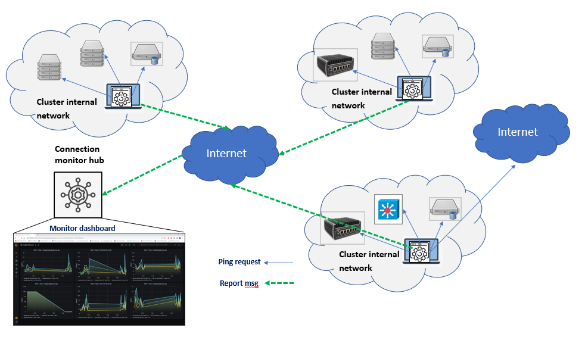
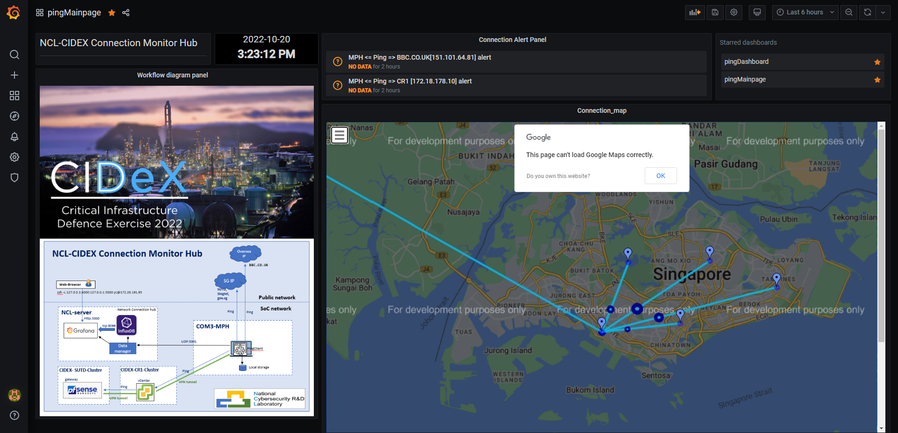
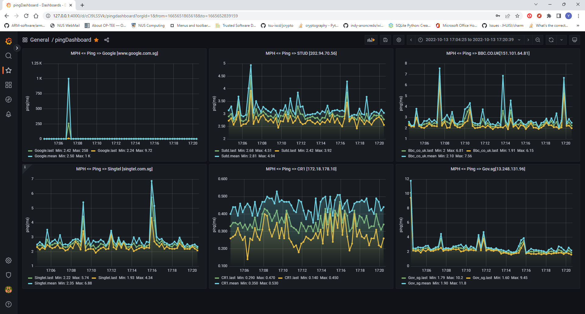
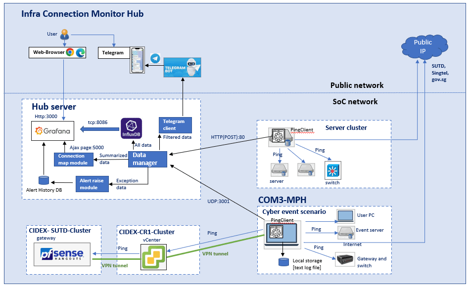
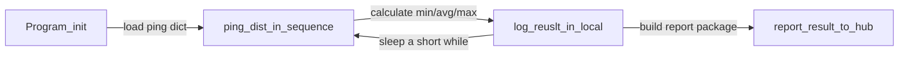
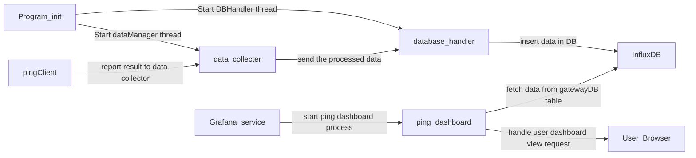
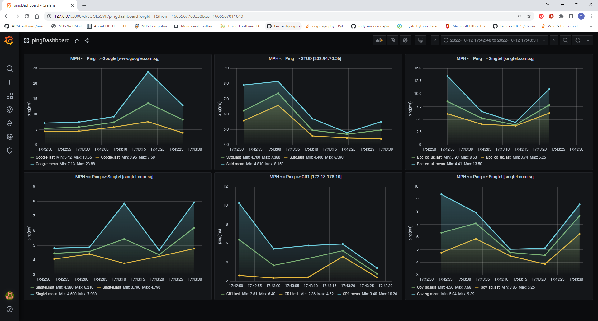

# Network Connection Dashboard [Ping]

**Program Design Purpose**: This program is a monitor hub system to check and display the servers/nodes connection state in each clusters' internal network. It can also used to monitor the network connection from a network to different specific peer/destination. 

[TOC]


------


### Introduction


We want to check the NUS-COM3 multi purpose hall (MPH) 's internet and ethernet connection during a cyber-event. The system contents two pars: 

1.  **pingClient** program: the pingClient program is the agent program running on any of the computer inside the cluster. It contents a ping list and will ping the destination ip-address/domain periodically, after collected the enough data, it will report the result to the monitor hub for data visualization. It will also keep all the ping data in local storage as a back incase the client lose the connection to the monitor hub.
2.  **monitorHub** program: The monitorHub program is a web-host program with one data manager to collect the data from all the client and save the processed data into database , one dataBase to store the data and one dashboard host to allow the user to check the real time cluster state. 

This is the system work topology diagram:



`version 0.1`

Web-dashboard UI view: 

The Web dashboard contents 2 part: 

**Home Page**: The home page will show a google map marked the ping client server's geo-location (GPS-position) and the ping destination, a dashboard list to show all the ping detail dashboards and a alert list to show all the connection alert. 




**Ping Detail Dashboard**: The ping dashboard will show all the ping chart diagram of the pingClient to every destination. 




------

### Program Design

The system workflow diagram will be show below:



##### pingClient

Ping client will run as shown in the below workflow: 



- User can pre-config the ping frequency in the config file and report frequency.
- The client will calculate the ping min/avg/max value and log in the file. 
- The log file will be in the same directory as the program under `Logs` folder.
- The log file nae format will be like this :  `ping_20221013_134258_1.txt` and the log each line of the log report will be same format as below: 

```
2022-10-13 13:42:58,715 INFO     [Google]: min:3.96,avg:5.29,max:6.83
2022-10-13 13:42:59,740 INFO     [CR1]: min:2.32,avg:3.7,max:6.99
2022-10-13 13:43:00,771 INFO     [Sutd]: min:4.38,avg:5.24,max:6.84
2022-10-13 13:43:01,852 INFO     [Singtel]: min:4.92,avg:7.16,max:8.91
```

- Report to the hub by using UDP [port 3001]


**monitorHub** 

The monitor hub run as shown in the below workflow:



- Save every ping data as a node in influxDB [table: gatewayDB]
- Start data manager/collector to start a UPD server to handle the client data submit request. 
- Grafana data fetch sql example: `SELECT last("avg") FROM "Google" WHERE $timeFilter GROUP BY time($__interval) fill(none)`


------

### Program Setup

###### Development Environment : Python3.7.4, HTML+flask, Grafana Dashboard, InfluxDB.

#### Additional Lib/Software Need

##### 1.Python Lib installation

- **pythonping**: https://pypi.org/project/pythonping/ , Install: `pip install pythonping`
- **influxdb**: https://pypi.org/project/influxdb/ , install: `pip install influxdb`

##### 2.Grafana installation

- Windows: https://grafana.com/docs/grafana/latest/setup-grafana/installation/windows/
- Ubuntu: https://computingforgeeks.com/how-to-install-grafana-on-ubuntu-linux-2/

##### 3.InfluxDB installation

- Windows: https://docs.influxdata.com/influxdb/v2.4/install/?t=Windows
- Ubuntu: https://docs.influxdata.com/influxdb/v1.8/introduction/install/ or https://docs.influxdata.com/influxdb/v1.8/introduction/get-started/

###### Hardware Needed: None


------


#### Program files list 

| Program File        | Execution Env | Description                                                  |
| ------------------- | ------------- | ------------------------------------------------------------ |
| src/influxClient.py | python3       | Monitor hub data manager:  run as the bridge(data manager) between the influxDB database and all the report-clients. It will collect the message from the ping clients, do data filtering and insert valid data in the database. |
| src/pingClient.py   | python3       | This module will ping the destination ip/url in the dict periodically, save the ping result in local disk and report result to the server side. |
| src/Log.py          |               | message log module.                                          |
| src/udpCom.py       |               | UDP data communication module.                               |


------

### Program Usage


##### Deploy the ping client script in the cluster need to monitored

1. Copy the src in one of the server/computer/laptop in the cluster, make sure the port 3001 UDP egress is configured as 'enable'

2. Change the Hub ipaddress and the test mode flag in the file `pingClient.py`  as show below:

```
TEST_MD = True  # Test mode flag.
HUB_IP = ('127.0.0.1', 3001) if TEST_MD else ('172.18.178.6', 3001) 
```

3. Add the ping destination in the address dictionary as shown below :

```
ipAdrrDict = {
    'Google':   'www.google.com.sg',
    'CR1':      '172.18.178.10',
    'Sutd':     '202.94.70.56',
    'Singtel':  'www.singtel.com.sg',
    'Gov_sg':   'gov.sg',
    'Bbc_co_uk':'BBC.CO.UK'
}
```

4. Run the ping client program:

```
Win cmd: python pingClient.py
Ubuntu cmnd: sudo python3 pingClient.py
```


##### Deploy the monitor hub 

**Step-1: Start the influxDB service** 

Windows: Go to the influxDB installation folder and run the file `influxd.exe`

```
example: D:\Tools\InfluxDB\influxdb-1.8.1-1 .influxd.exe
```

Ubuntu:

```

```

**Step-2: Start the Grafana service**

Windows: auto run after you finish the config

Ubuntu:

```
sudo systemctl restart grafana-server
sudo systemctl status grafana-server
```

**Step-3: run the monitor hub main program** 

```
python influxClient.py
```

**Step-4: Access the dashboard**

Open dashboard url:  http://127.0.0.1:3000/ to access the dashboard home page: 


Then select the dashboard in the dashboard list:



Default Grafana admin password `admin / admin`


------

### Problem and Solution

Refer to `doc/ProblemAndSolution.md`


------

### Reference Link


------

> Last edit by LiuYuancheng(liu_yuan_cheng@hotmail.com) at 13/10/2022


