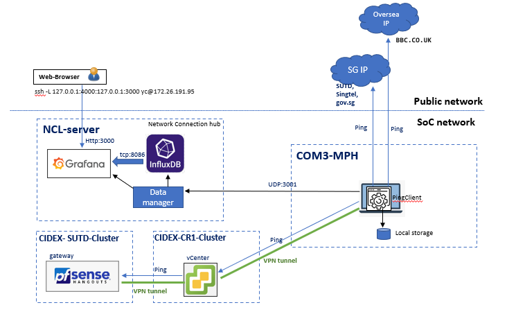
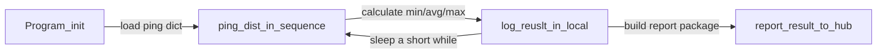
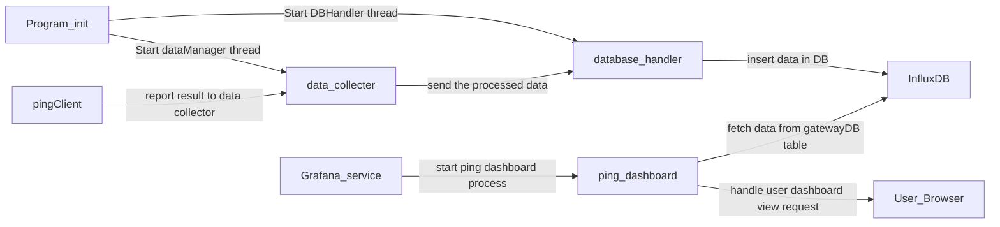

# Network Connection Dashboard [Ping]

**Program Design Purpose**: This program is a monitor hub program to check and display the servers/nodes connection state in each clusters' internal network. It can also used to monitor the network connection from a network to some specific peer/destination. 

[TOC]

------

### Introduction

We want to check the NUS-COM3's internet and ethernet connection during a cyber-event. The system contents two pars: 

1.  **pingClient** program: the pingClient program is the agent program running on any of the computer inside the cluster. It contents a ping list and will ping the destination ip-address/domain periodically, after collected the enough data, it will report the result to the monitor hub for data visualization. It will also keep all the ping data in local storage as a back incase the client lose the connection to the monitor hub.
2.  **monitorHub** program: The monitorHub program is a web-host program with one data manager to collect the data from all the client and save the processed data into database , one dataBase to store the data and one dashboard host to allow the user to check the real time cluster state. 

This is the system work topology diagram:


`version 0.1`

This is the dashboard View:


------

### Program Design

The system workflow diagram will be show below:



##### pingClient

Ping client will run as shown in the below workflow: 



- User can pre-config the ping frequency in the config file and report frequency.
- The client will calculate the ping min/avg/max value and log in the file. 
- The log file will be in the same directory as the program under `Logs` folder.
- The log file nae format will be like this :  `ping_20221013_134258_1.txt` and the log each line of the log report will be same format as below: 

```
2022-10-13 13:42:58,715 INFO     [Google]: min:3.96,avg:5.29,max:6.83
2022-10-13 13:42:59,740 INFO     [CR1]: min:2.32,avg:3.7,max:6.99
2022-10-13 13:43:00,771 INFO     [Sutd]: min:4.38,avg:5.24,max:6.84
2022-10-13 13:43:01,852 INFO     [Singtel]: min:4.92,avg:7.16,max:8.91
```


**monitorHub** 

The monitor hub run as shown in the below workflow:




